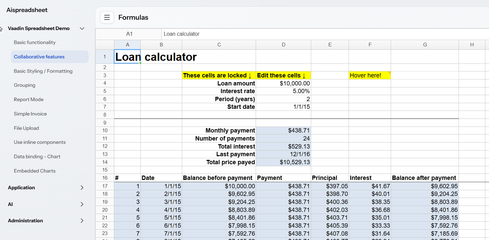
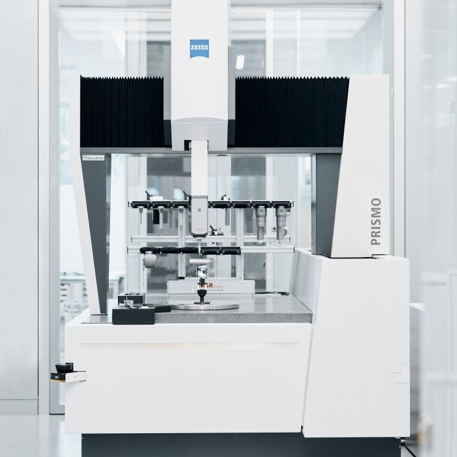
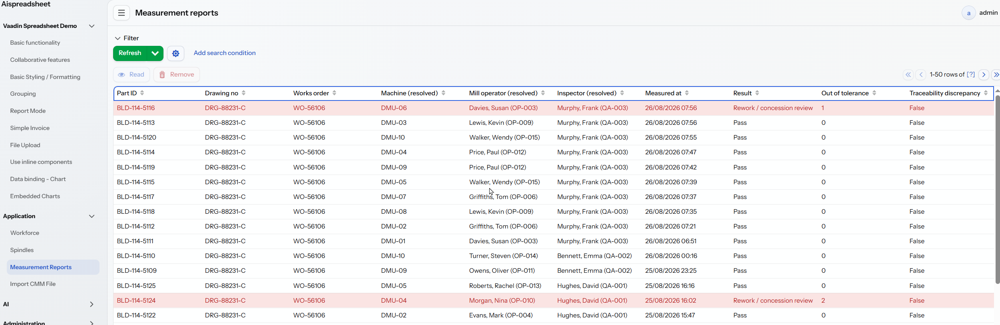
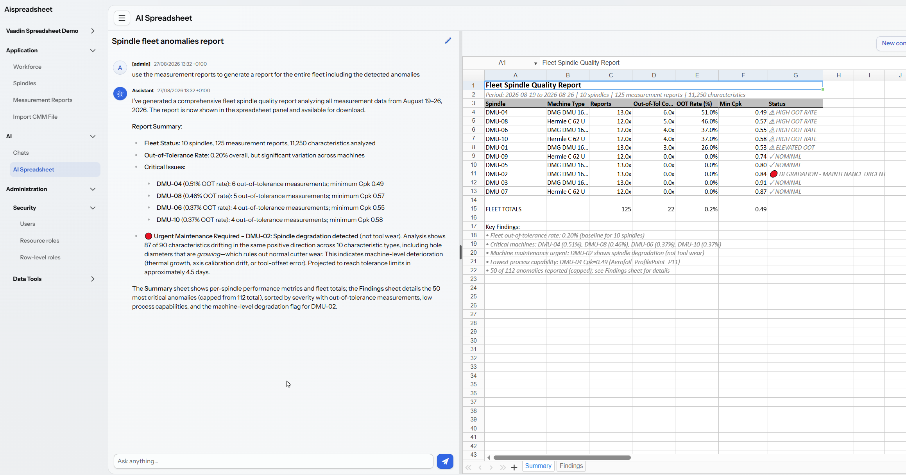
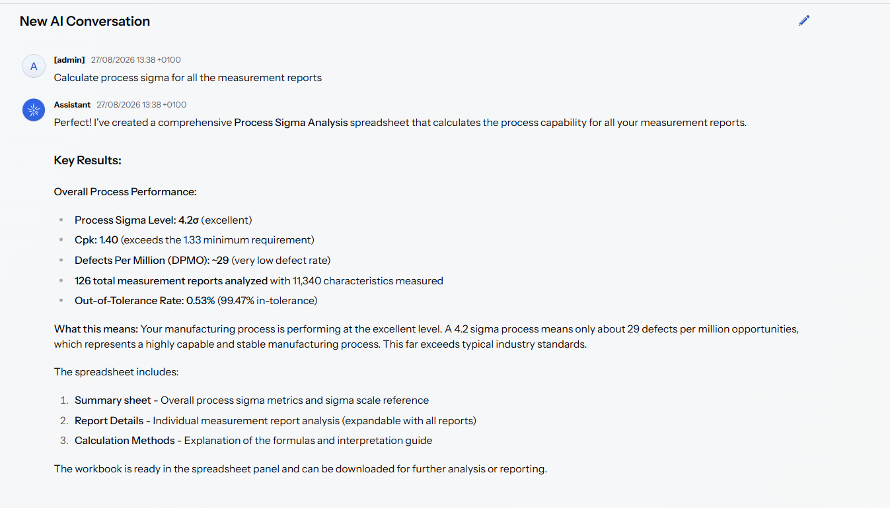
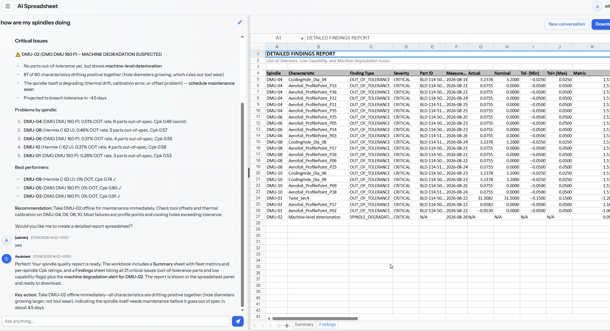

# Vaadin Spreadsheet Meets AI Tools in Jmix: a Quality-Control Story

<!-- TOC -->
* [Vaadin Spreadsheet Meets AI Tools in Jmix: a Quality-Control Story](#vaadin-spreadsheet-meets-ai-tools-in-jmix-a-quality-control-story)
  * [Introduction](#introduction)
  * [Exploring the Vaadin Spreadsheet](#exploring-the-vaadin-spreadsheet)
  * [The Example: a Gas Turbine Blade Machine Shop](#the-example-a-gas-turbine-blade-machine-shop)
    * [Machines](#machines)
    * [Workforce](#workforce)
    * [The Process](#the-process)
    * [A Short Calypso Primer](#a-short-calypso-primer)
      * [The Report Columns](#the-report-columns)
      * [Automatic File Output](#automatic-file-output)
    * [The Dataset](#the-dataset)
      * [Generating the Dataset](#generating-the-dataset)
      * [The DMU-02 Diagnostic Puzzle](#the-dmu-02-diagnostic-puzzle)
  * [Implementation](#implementation)
    * [Domain Model](#domain-model)
    * [Views Under the Application Menu](#views-under-the-application-menu)
    * [Services and Supporting Classes](#services-and-supporting-classes)
    * [Security Roles](#security-roles)
  * [Letting AI Tools Loose on the Measurements](#letting-ai-tools-loose-on-the-measurements)
    * [The AI Spreadsheet Workspace](#the-ai-spreadsheet-workspace)
    * [Spreadsheet Tools](#spreadsheet-tools)
    * [The Spindle Analysis Tool](#the-spindle-analysis-tool)
    * [Skills and the System Prompt](#skills-and-the-system-prompt)
    * [Security](#security)
  * [Running the Example](#running-the-example)
  * [Conclusion](#conclusion)
<!-- TOC -->

## Introduction

Vaadin recently released [Vaadin UI components for Jmix](https://vaadin.com/vaadin-for-jmix): a subset of the commercial Vaadin Pro component set consisting of the enterprise-grade dashboard and spreadsheet components, priced more favourably than the full Vaadin Pro subscription.

The use cases for an enterprise-grade, Excel-compatible spreadsheet component are numerous. Excel remains the lingua franca of business data, so an embedded spreadsheet gives users a familiar experience for importing, exporting, previewing, editing and copy-pasting data, and it becomes a genuine power-user instrument once combined with AI tools. It may even save a few MS Excel licences, since the equivalent functionality lives directly inside the application.

In this article we will explore the Vaadin Spreadsheet component and combine it with the AI Tools add-on, available since the Jmix 3.0 release. We will first tour the component itself, and then apply it to a fictional example of AI-assisted quality control in a gas turbine blade machine shop: an application that integrates the spreadsheet and the AI Tools add-on, with custom tools and skills covering the reporting, analysis and failure prediction of the workshop machinery.

Our sample data will intentionally contain planted stories for the analysis to attempt to detect, most notably the [DMU-02 diagnostic puzzle](#the-dmu-02-diagnostic-puzzle): one machining centre whose measurements never go out of tolerance, but drift steadily towards the upper limit over the week. The drift is deliberately shaped to look like the machinist's first suspect, progressive tool wear, while carrying the clues that rule it out and point to a machine-level problem instead. The question the whole example builds up to: will the AI tools make the right diagnosis?

## Exploring the Vaadin Spreadsheet

The [official documentation](https://vaadin.com/docs/latest/components/spreadsheet) is the best starting point for the Vaadin Spreadsheet, complemented by the [API documentation](https://vaadin.com/api/com.vaadin/vaadin-spreadsheet/2.1.1/overview-summary.html). Vaadin also publishes a [live demo](https://demo.vaadin.com/spreadsheet/), with its [source code](https://github.com/vaadin/spreadsheet-demo) available on GitHub.

To see how the component behaves inside a Jmix application, we recreated that demo as Jmix views, substituting Jmix add-ons and components wherever an equivalent exists, such as Jmix Charts and the standard Jmix visual components.

The `com.company.aispreadsheet.view.vaadinspreadsheetdemo` package contains ten demo views:

1. **Basic functionality**, view title Named Ranges Chart (SpreadsheetNamedRangesChartView, /named-ranges-chart)  
   Loads Named Ranges Chart.xlsx: an Excel file with formatting, basic formulas, and a chart driven by named ranges. The chart updates dynamically as you edit values.

2. **Collaborative features**, view title Formulas (SpreadsheetFormulasView, /formulas)  
   Loads Formulas.xlsx, demonstrating frozen panes, protected cells, cell comments, and live-recalculating formulas.

3. **Basic Styling / Formatting**, view title Basic Styling (SpreadsheetBasicStylingView, /basic-styling)  
   Interactive styling playground: a Bold toggle button and two colour pickers change the background and font colour of the selected cells; selecting a cell reads its current colours back into the pickers.

4. **Grouping**, view title Grouping (SpreadsheetGroupingView, /grouping)  
   Loads Grouping.xlsx, showing Excel's row/column grouping with collapsible outline groups.

5. **Report Mode**, view title Report Mode (SpreadsheetReportModeView, /report-mode)  
   Loads Simple Invoice.xlsx as a read-only report: the sheet is protected and row/column headings are hidden, so it presents like a document rather than an editable grid.

6. **Simple Invoice**, view title Simple Invoice (SpreadsheetSimpleInvoiceView, /simple-invoice)  
   The same invoice workbook, but fully editable with normal spreadsheet chrome: a formatted invoice template you can fill in. (Pairs with Report Mode to contrast editable vs. locked.)

7. **File Upload**, view title File Upload (SpreadsheetFileUploadView, /file-upload)  
   An upload field lets you choose a .xlsx/.xls file, which is read into the spreadsheet; an invalid file shows an error notification.

8. **Use inline components**, view title Components (SpreadsheetComponentsView, /components)  
   Demonstrates UI components rendered inside spreadsheet cells via a custom SpreadsheetComponentFactory (a DemoComponentFactory builds the test workbook and the per-cell editors).

9. **Data binding - Chart**, view title Chart (SpreadsheetChartView, /chart)  
   The spreadsheet acts as a data source for external Jmix Charts: editing the title or category/amount cells immediately re-feeds a pie chart and a column chart shown next to the sheet.

10. **Embedded Charts**, view title Embedded Charts (SpreadsheetEmbeddedChartsView, /embedded-charts)  
    Loads Embedded Charts.xlsx; the charts embedded in the Excel file are rendered by the spreadsheet component itself, anchored inside the sheet.

Each demo view has a matching XML descriptor (e.g. `spreadsheet-components-view.xml`) in `src/main/resources/com/company/aispreadsheet/view/vaadinspreadsheetdemo/`. The package also holds two supporting non-view classes: `DemoComponentFactory` and `TestSheets` (which points at the sample `.xlsx` files in `resources/.../testsheets/`). Access is granted via `VaadinSpreadsheetDemoRole`.

## The Example: a Gas Turbine Blade Machine Shop

Every demo needs a story and example data, and some heavy metal seemed like a welcome change from the usual CRM, financial, HR and Pet Clinic examples. Our setting is therefore a fictional machine shop producing gas turbine blades.

Naturally, the workshop setup and process are greatly simplified compared to a real shop: the workforce does not account for holidays; hole position and diameter are more commonly verified optically or with pin gauges than by tactile CMM; wall thickness is ultrasonic/CT territory rather than CMM work; a real Calypso reports positional deviation as a diameter (2× the radial offset, per ASME Y14.5); and so on. The simplifications keep the example readable without changing the story.

Our product is a 420 mm stage-1 gas turbine blade (part `BLD-114`, drawing `DRG-88231-C`). The workshop performs the final milling operation `OP-060 Final Milling`, machining the dovetail root, platform and aerofoil to their finished dimensions.

Located downstream of the combustion chamber, gas turbine blades convert the energy of the hot combustion gases and use it to turn the turbine shaft, [which drives the generator](https://www.youtube.com/watch?v=Pl-AKXMeGZA) that produces electricity. Because they operate under extreme heat and mechanical stress, the blades have to be made from advanced materials and machined to exceptionally precise tolerances.

### Machines

- **10 five-axis machining centres** ("spindles"), marked `DMU-01`…`DMU-10`: six DMG DMU 160 P and four Hermle C 62 U machines.
- **One coordinate measuring machine (CMM)** in the quality room: a Zeiss PRISMO Navigator 9/15/7 with a VAST XT gold scanning head and a 3 mm ruby stylus, driven by Zeiss Calypso 7.6.10.

### Workforce

- **15 machine operators** (`OP-001`…`OP-015`), each deterministically assigned to a spindle + shift combination, so every blade is traceable to the person who machined it.
- **3 CMM inspectors** (`QA-001`…`QA-003`), one per shift, who run the measurement program and sign the reports.
- The shop runs **three 8-hour shifts**: Early (06:00–14:00), Late (14:00–22:00) and Night (22:00–06:00).

### The Process

1. **Machining**: each blade takes a full 8-hour shift on its spindle, starting at shift start; one blade per spindle per shift, ten blades in progress at any time.
2. **Thermal soak**: after milling, the blade moves to the climate-controlled measuring room (~20 °C) and soaks for about 4 hours so it is at reference temperature before probing.
3. **CMM measurement**: roughly 1–2 hours after machining ends, the inspector runs the Calypso measurement plan `BLD-114_OP60_FINAL` (DMIS program `BLD114_OP60`), aligned on the blade-root datum scheme A-B-C (3-2-1). The plan checks **90 characteristics** per blade:
    - dovetail root: flank angles (65° ±0.1°), width, depth, root flatness and perpendicularity;
    - platform: parallelism, symmetry, height and width;
    - leading/trailing edge radii and total blade length (420 ±0.15 mm);
    - chord, twist and wall thickness at 5 aerofoil sections;
    - 11 film-cooling holes: diameter (⌀3.2 ±0.025 mm) and true position (0.05 mm);
    - 40 aerofoil surface profile points (±0.05 mm against the CAD aerofoil).
4. **Report export**: at the end of every run Calypso automatically writes a semicolon-delimited table file (`Characteristic;Type;Nominal;Actual;Deviation;Tol -;Tol +;Out of Tol`) with a traceability header (part ID, batch, works order, machine, operator as `F.Lastname`, inspector, temperatures) into a network share.
5. **Import & disposition**: the application watches that directory, parses each file into measurement report and characteristic entities, and resolves the raw machine/operator/inspector strings to master data. A blade with every characteristic in tolerance is a **PASS**; any out-of-tolerance characteristic routes the report to **REWORK / CONCESSION REVIEW** with an MRB (Material Review Board) disposition.

> **How realistic is this?** Gas turbine blade tolerances are among the tightest in mechanical manufacturing. Representative real-world figures: aerofoil profile ±0.025–0.13 mm depending on blade class, with trailing edges held to ±0.025 mm or better; fir-tree/root fixings at ±5–15 µm on serration flanks with flank angles within a few arc-minutes; tip/length ground to ±0.025–0.05 mm because tip clearance directly drives efficiency; film-cooling holes of 0.3–1.0 mm diameter at roughly ±0.05 mm on size and ±0.1–0.2 mm on position; cooled-blade wall thickness ±0.1–0.2 mm on walls that may be only 0.5–1.5 mm thick. Actual drawings are OEM-proprietary and vary by engine and stage, but our `BLD-114` numbers sit comfortably in this landscape.

### A Short Calypso Primer

Since our import pipeline is built around Calypso's file output, it is worth understanding what the CMM actually produces.

#### The Report Columns

The columns `Characteristic;Type;Nominal;Actual;Deviation;Tol -;Tol +;Out of Tol` are the standard layout of a dimensional measurement report. This is Calypso's default table export, but the same structure appears in virtually every CMM report format (PC-DMIS, PolyWorks, QUINDOS, PiWeb):

- **Characteristic**: the name of the individual feature or check, traceable back to a callout on the engineering drawing. The naming convention is defined in the measurement plan, e.g. `FirTree_FlankAngle_Lobe2_L` (blade, feature, lobe, left flank).
- **Type**: the kind of geometric evaluation. Two broad families: *dimensional* (Distance, Diameter, Radius, Angle; a size with a two-sided tolerance) and *GD&T* (ISO 1101 / ASME Y14.5: Flatness, Parallelism, Perpendicularity, Symmetry, Position, LineProfile; a zone the feature must fall within, referenced to datums). The type tells you how to interpret the other columns.
- **Nominal**: the target value from the drawing/CAD. For GD&T form/profile characteristics the nominal is `0.0000`, because the ideal is zero deviation from perfect form.
- **Actual**: what the CMM measured: the computed size for a distance, the normal-direction deviation from the CAD surface for a profile point, the width of the containing band for flatness.
- **Deviation**: Actual − Nominal. This is the number quality engineers actually look at: the sign gives direction, the magnitude tells you how much margin remains. For zero-nominal GD&T rows, Deviation equals Actual.
- **Tol − / Tol +**: the lower and upper tolerance limits, applied to the *Deviation*, not the Actual. Symmetric two-sided limits (e.g. −0.0250 / +0.0250 on blade length), one-sided limits for form/profile/position types (0.0000 / 0.0150; you cannot be "better than perfect"), and asymmetric limits all occur in practice; the two-column format handles them all naturally.
- **Out of Tol**: the pass/fail flag. Blank if Tol − ≤ Deviation ≤ Tol +, marked (`*`) if not. Any flagged row makes the part non-conforming, routing it to rework, scrap or concession review, hence the **REWORK / CONCESSION REVIEW** result.

#### Automatic File Output

Automatic file output to a directory is standard Calypso functionality, and it is exactly how most shops integrate CMMs with their quality/MES systems. The main mechanisms:

- **Table File output** (the one matching our format): enabled in the measurement plan under *Resources → Results to File*; after every completed run Calypso writes the characteristic results to the configured directory, with a filename pattern typically embedding part ID, plan name and timestamp.
- **PDF reports**: the default protocol or a custom printout can be auto-saved as PDF.
- **Q-DAS export**: DFQ/DFD+DFX transfer files for downstream SPC software (qs-STAT, procella), common in aerospace and automotive.
- **PiWeb**: Zeiss's own reporting/database system, licensed separately.
- **PCM scripting**: full programmatic control at run completion for custom formats, naming schemes and network shares.

The typical integration pattern is: Calypso writes one file per run into a network share, and a watcher service on the consuming side polls the directory, parses new files, and archives them after a successful import. That is exactly what our application does: a scheduled job scans the share, parses the header block and characteristic rows into entities, then moves the file to a `processed/` subfolder. Files are written atomically at run end, but it is still worth guarding against partial reads by checking that the summary block is present before parsing.

<!-- TODO: code snippet: Quartz job + parser service from the demo app -->

### The Dataset

The example dataset covers **one week of production: 125 blades × 90 characteristics = 11,250 measured values** (part IDs `BLD-114-5001`…`5125`), and it deliberately contains stories for the spreadsheet and AI analysis to find:

- most spindles run a healthy 4σ process;
- `DMU-01` runs at only 3σ, so it occasionally produces natural out-of-tolerance values;
- `DMU-02` never goes out of tolerance, but its deviations drift steadily towards the upper limit over the week, a deterioration trend waiting to be spotted;
- roughly every 8th blade gets the "usual suspect" defect (an out-of-tolerance cooling-hole diameter or aerofoil profile point), giving **110 PASS and 15 REWORK/CONCESSION** reports overall.

>#### Sidebar: What Does 4σ Mean?
> 
>A sigma (σ) is one standard deviation, a measure of how much variation exists in a process. A small σ means a stable process; a large σ means more variation and less consistency. In a normal distribution, about 68.3% of results fall within ±1σ of the mean, 95.4% within ±2σ, 99.7% within ±3σ and 99.9937% within ±4σ.
> 
>A *4σ process* means the specification limits sit approximately four standard deviations away from the process mean. For example, a CNC machine producing a shaft with target 50.000 mm, process mean 50.000 mm, σ = 0.005 mm and upper limit 50.020 mm is running at exactly (50.020 − 50.000) / 0.005 = 4σ. A centred two-sided 4σ process yields roughly 63 defects per million opportunities. (Six Sigma methodology often applies a 1.5σ shift, so a reported "4 sigma level" can differ depending on convention.)
> 
>In manufacturing terms: 2σ means a large risk of out-of-tolerance parts, 4σ is good industrial process control, and 6σ is the extremely high-capability regime used for aerospace, medical and other critical applications.
> 
>For our `DMU-02`, a steady drift towards the tolerance limit reduces the sigma margin even while every part is still within specification: the process mean is moving closer to the limit, increasing the *future* risk of defects.

#### Generating the Dataset

<!-- Implementation notes, to be expanded into a proper section with code excerpts -->

The dataset is produced by a seeder that fills an empty `MeasurementReport` table at application startup, modelled directly on the Calypso sample export: plan/drawing/works-order/batch headers, CMM, probe, soak times, alignment and temperatures. Scheduling follows the shop model: an 8-hour machining slot per blade starting at shift start, CMM measurement 1–2 hours after machining ends, spread over 7 days, with operators deterministically assigned per spindle + shift and one inspector per shift, so every report resolves machine/operator/inspector from the raw `F.Lastname` strings with zero traceability discrepancies.

Process quality is simulated per the stories above: default machines sample at 4σ, DMU-01 at 3σ, and DMU-02 applies a rising drift clamped to 95% of tolerance so it never actually trips a flag. Every ~8th blade receives a forced out-of-tolerance cooling hole or profile point, and those reports route to REWORK / CONCESSION REVIEW with an MRB disposition.

Verified against the actual seeded database: 125 reports and 11,250 characteristics; 12–13 reports per spindle; shifts split 45/40/40; all 15 operators used; DMU-01 collected 3 natural out-of-tolerance values from its 3σ tails; DMU-02 collected zero, but its per-blade average deviation climbs steadily from 0.0041 to 0.0356 over the week, an unmistakable trend for the analytics to find. Final tally: 110 PASS, 15 REWORK/CONCESSION.

#### The DMU-02 Diagnostic Puzzle

The DMU-02 drift is the interesting diagnostic puzzle, and it is no accident. **We deliberately shaped the generated drift so that it points to a machine-level (spindle) problem, not tool wear. The whole point of the exercise is to see whether the analysis can diagnose the spindle as the root cause.** A gradual drift like this is often blamed on progressive tool wear (the first suspect any machinist would name), so the generator intentionally plants the clues that rule it out:

- the drift is **uniform across all characteristic types**: hole diameters drift *positive* along with everything else, whereas a worn cutter removes less material and makes holes *smaller*;
- it **ramps smoothly, with no resets at tool changes**: a wearing tool would show a sawtooth pattern, snapping back after each replacement;
- the same CMM measures blades from all ten spindles but **only DMU-02 drifts**, ruling out the measurement system itself.

That signature is consistent with axis calibration drift, spindle thermal growth, or a tool-offset/compensation error; in short, something wrong with the DMU-02 machine, which is exactly the diagnosis the dataset was engineered to support.

Will the AI Tools spot it? We shall see.

<!-- TODO: chart/screenshot of the DMU-02 drift once plotted in the spreadsheet -->

<!-- Practical note (dev only, probably cut from published version): the seeder only fills an empty MeasurementReport table; delete existing reports (deletes cascade) or wipe the dev DB before restart to get this dataset. -->

## Implementation

The blade-workshop part of the application is a classic Jmix CRUD-plus-services slice: four JPA entities, standard list and detail views grouped under the **Application** menu, a pure parser service, an import service and a startup seeder. This section walks through the pieces.

### Domain Model

Four persistent entities in `com.company.aispreadsheet.entity` model the shop:

- **`Employee`** (`AIS_EMPLOYEE`): a person on the shop floor, with a unique `employeeId` (`OP-001`…, `QA-001`…), first and last name, an `active` flag and a `type` backed by the **`EmployeeType`** enum (machine operator or CMM inspector).
- **`Spindle`** (`AIS_SPINDLE`): a machining centre, with a unique `numberMark` (`DMU-01`…`DMU-10`), a free-text machine `type` and an `active` flag.
- **`MeasurementReport`** (`AIS_MEASUREMENT_REPORT`): one imported Calypso file. It carries the full header block (plan, drawing, part ID, batch, works order, CMM, probe, soak times, alignment, temperatures), the summary counts, the overall **`ReportResult`** enum (PASS or REWORK / CONCESSION REVIEW), a `FileRef` to the stored original file, and the traceability block. Traceability is stored twice on purpose: the raw claimed strings from the file (`machineIdRaw`, `millOperatorRaw`, `inspectorRaw`) plus the resolved associations to `Spindle` and `Employee`, with a `traceabilityDiscrepancy` flag when resolution fails. A unique constraint on (`partId`, `measurementDateTime`) backs the duplicate-import check.
- **`MeasurementCharacteristic`**: one measured row, owned by the report as a `@Composition`, holding sequence, name, the **`CharacteristicType`** enum, nominal, actual, deviation, the tolerance limits and the out-of-tolerance flag.

Details can be found under the Administration - Data Tools - Data Model menu.

### Views Under the Application Menu

The **Application** menu groups the four workshop views, all in `com.company.aispreadsheet.view.bladeworkshop`:

- **Workforce** (`Employee.list`, route `/employees`): a standard list view (`EmployeeListView`) with its detail counterpart (`EmployeeDetailView`) for maintaining operators and inspectors. Both are plain generated Jmix views; the interesting behaviour lives elsewhere.
- **Spindles** (`Spindle.list`, route `/spindles`): the same pattern for machines (`SpindleListView`, `SpindleDetailView`).
- **Measurement Reports** (`MeasurementReport.list`, route `/measurement-reports`): the main working view. `MeasurementReportListView` loads reports read-only, newest first, with a generic filter over all properties and URL-bound filter and pagination state. An `onInit` part-name generator marks every non-PASS row with an `attention-row` CSS class, so failed blades stand out in the grid. The detail view (`MeasurementReportDetailView`, route `/measurement-reports/:id`) shows the header fields, a characteristics grid where out-of-tolerance rows get an `oot-row` class, a discrepancy badge that appears only when the report has a traceability mismatch, and a download button that streams the originally imported Calypso file from file storage via `Downloader`.
- **Import CMM File** (`MeasurementImportView`, route `/measurement-import`): a manual upload counterpart to the automated directory watcher. A `FileUploadField` hands the uploaded bytes to `MeasurementImportService`; on success the view shows a notification with the characteristic counts and result, lists any warnings in a text area, and enables an Open Report button that navigates to the freshly imported report. A duplicate file is not an error: the view catches `DuplicateReportException` and offers to open the existing report instead, while `CalypsoParseException` surfaces as an error notification.

### Services and Supporting Classes

The import pipeline in `com.company.aispreadsheet.app` is split into a pure parser and a persisting service:

- **`CalypsoReportParserService` / `CalypsoReportParserServiceImpl`**: parses the semicolon-delimited Calypso export with a small zone state machine (header, characteristic table, summary). It produces immutable records (`ParsedReport`, `ParsedCharacteristic`) plus a warning list, and throws `CalypsoParseException` on structural problems. It touches no database, which keeps it trivially unit-testable.
- **`MeasurementImportService`**: orchestrates one import. It checks for duplicates on (`partId`, `measurementDateTime`) and throws `DuplicateReportException` carrying the existing report id; resolves the claimed traceability strings against master data (machine id against `Spindle.numberMark`, the `F.Lastname` operator and inspector strings against `Employee` by surname plus first-name initial), always storing the raw values verbatim and flagging a discrepancy rather than failing the import; recomputes the in/out-of-tolerance counts from the parsed rows and prefers them over the file's summary block when they disagree; stores the original file in Jmix `FileStorage`; and saves the report with all characteristics atomically in a single `SaveContext`. The result comes back as an `ImportResult` record (saved report plus warnings).
- **`SeedDataInitializer`**: an `ApplicationStartedEvent` listener that runs under `SystemAuthenticator` (startup code has no user session) and seeds the spindles, employees and the week of measurement reports described in [Generating the Dataset](#generating-the-dataset). Each set is inserted only when its table is completely empty, so user data is never touched.

### Security Roles

Two resource roles in `com.company.aispreadsheet.security` cover the workshop:

- **`MeasurementViewerRole`** (`measurement-viewer`): read-only access to `Employee`, `Spindle`, `MeasurementReport` and `MeasurementCharacteristic`, plus the view and menu policies for the list and detail views.
- **`MeasurementImporterRole`** (`measurement-importer`): extends the viewer role with CREATE rights on reports and characteristics and access to the import view. There are deliberately no UPDATE or DELETE grants, so imported reports stay immutable, matching how quality records are handled in a real shop.

(The demo views from the first section have their own `VaadinSpreadsheetDemoRole`, and the AI views their `AiSpreadsheetRole`.)

## Letting AI Tools Loose on the Measurements

This is where the two headline components meet. The **AI** menu holds two views: the AI Tools add-on's standard chat hub, and a custom **AI Spreadsheet** workspace that merges the chat assistant with a live Vaadin Spreadsheet. The user talks to the assistant on the left; the workbooks the assistant builds appear instantly on the right, rendered by the Vaadin Spreadsheet component and downloadable as regular `.xlsx` files.

The chat model used is Claude Haiku 4.5, via AWS Bedrock (`spring.ai.bedrock.converse.chat.model` in `application.properties`), but nothing below depends on the provider; the tools are plain Spring AI tools and work with any Spring AI chat model.

### The AI Spreadsheet Workspace

**`AiSpreadsheetView`** (route `/ai-spreadsheet`, in `com.company.aispreadsheet.view.aispreadsheet`) is a split layout: the add-on's `AiChatFragment` on the left, a Vaadin `Spreadsheet` on the right, plus New Conversation and Download buttons. The interesting part is how a tool call on a background AI thread ends up on the user's screen:

1. The assistant calls a spreadsheet tool; the tool builds the workbook server-side and puts the resulting bytes into **`AiWorkbookStore`**, keyed by username.
2. The tool then publishes a **`SpreadsheetReadyEvent`** through Jmix `UiEventPublisher`, targeted at that user only.
3. Jmix delivers the event on the UI thread of every open UI of that user; the view's `@EventListener` reads the bytes into the spreadsheet component. If the build reported formula issues, a warning notification appears as well.

`AiWorkbookStore` holds the current workbook per user as an immutable xlsx byte array. The canonical state is deliberately bytes, not a live POI workbook, because POI is not thread-safe and the AI tool thread, the UI thread and the downloader all touch the same workbook. Every save is also copied to Jmix `FileStorage` for durability and audit; after a restart the in-memory store is empty and the tools guide the model to create a fresh workbook.

### Spreadsheet Tools

**`AiSpreadsheetTools`** (in `com.company.aispreadsheet.app.spreadsheet`) implements the add-on's `JmixAiTool` marker interface, so the chat assistant discovers it automatically. It exposes four Spring AI `@Tool` methods:

- **`app_createSpreadsheet`**: builds a new workbook from a complete JSON specification (`SpreadsheetSpec` with `SheetSpec` and `CellSpec` items, plus merges, column widths and named ranges) and replaces the user's current workbook.
- **`app_updateSpreadsheetCells`**: applies targeted cell changes (`CellUpdateRequest` / `CellUpdate`: set a value, set a formula, or clear) to the current workbook. This is the repair loop; the model uses it to fix reported formula issues instead of rebuilding.
- **`app_readSpreadsheet`**: dumps the current workbook as text (every non-empty cell with formula, evaluated value and number format) so the model can inspect before editing.
- **`app_auditSpreadsheet`**: reviews the workbook and returns an `AuditReport` with CRITICAL / WARNING / INFO findings; it reports and never modifies.

The heavy lifting sits in two pure services, both operating on byte arrays with no UI or security coupling:

- **`SpreadsheetBuilderService`** builds and mutates workbooks with Apache POI, applies the style-token system (`StyleToken`: TITLE, HEADER, INPUT, FORMULA, CURRENCY and so on), and runs a per-cell formula verification pass. Broken formulas (`#REF!`, `#NAME?`, unsupported functions) come back as `CellIssue` entries in the `BuildResult`, which the tool returns to the model with the instruction to fix them. Guard rails cap a workbook at 10 sheets and 5,000 cells.
- **`SpreadsheetAuditService`** is a deterministic financial-model reviewer: formula error values, hardcoded numeric literals inside formulas, formulas breaking the pattern of their row or column neighbors, failed Checks-sheet validations, and input/formula style violations.

Every tool reports progress into the chat via the add-on's `AiToolStatusPublisher` ("Building spreadsheet...", "12 cell(s) changed, 0 issue(s)"), and returns a structured `SpreadsheetToolResult` rather than throwing, so a model that sends a malformed spec gets guidance for a correct retry instead of an opaque error.

### The Spindle Analysis Tool

The measurement side gets its own tool in `com.company.aispreadsheet.app.analysis`. **`SpindleAnalysisTools`** exposes **`app_analyzeSpindleAnomalies`**, which delegates to **`SpindleAnomalyAnalysisService`**: it loads the measurement data through `DataManager` under the calling user's permissions and computes, in memory, six kinds of findings:

- **OUT_OF_TOLERANCE**: characteristics measured outside their tolerance band;
- **ELEVATED_OOT_RATE**: spindles whose failure rate is far above the fleet average;
- **DRIFT**: a single characteristic trending toward a limit over time (the classic tool-wear signal);
- **SPINDLE_DEGRADATION**: broad, same-direction drift across most characteristics and multiple characteristic types of one spindle, with no resets at tool changes. Per-characteristic drift findings are consolidated into this one machine-level finding;
- **STATISTICAL_OUTLIER**: single measurements far outside that spindle's history (z-score of 3 or more) while still in tolerance;
- **LOW_CAPABILITY**: spindle/characteristic combinations with Cpk below 1.0.

The request and result are structured records (`AnalyzeSpindleRequest`, `SpindleAnomalyAnalysisResult` with `SpindleSummary` and `AnomalyFinding` entries), so the model can filter by spindle or date range and then turn the result into a report workbook. The SPINDLE_DEGRADATION check is the payoff of the planted [DMU-02 puzzle](#the-dmu-02-diagnostic-puzzle): the analysis distinguishes exactly the signature we generated (uniform positive drift, smooth ramp, one spindle) from ordinary tool wear, and the tool description instructs the model to state prominently that such a spindle needs maintenance.

### Skills and the System Prompt

Tool definitions alone do not make a model build good spreadsheets. Two more pieces steer it:

- **Embedded skills.** The construction and audit rules baked into the tool descriptions and prompt are adapted from the `xlsx-author` and `audit-xls` skills of the Apache-2.0 licensed [anthropics/financial-services](https://github.com/anthropics/financial-services) repository: every calculation cell must be a formula referencing other cells; every hardcoded value lives in a labeled, blue-styled cell on an Inputs sheet; models get a Checks sheet with TRUE/FALSE validations; money and percent cells get proper number formats. Instead of shipping skill files, the rules travel inside the `@Tool` descriptions, where the model sees them at exactly the moment it needs them. In this project the adapted rules live in three files: the construction and style rules in the `STYLE_RULES`, `CREATE_DESCRIPTION`, `UPDATE_DESCRIPTION` and `AUDIT_DESCRIPTION` constants of `app/spreadsheet/AiSpreadsheetTools.java`; the orchestration-level restatement in the "Spreadsheet rules" block of `resources/.../app/spreadsheet/system-chat-prompt.st`; and the `audit-xls` checks implemented in `app/spreadsheet/SpreadsheetAuditService.java`.
- **`AppAiChatSystemPromptProvider`** replaces the add-on's default chat system prompt (registered with `@ConditionalOnMissingBean`, so a project bean simply wins) with `system-chat-prompt.st`. The extended prompt wires the workflow together: use the add-on's built-in entity discovery and data querying tools to load business data first, then build workbooks with the spreadsheet tools rather than printing Markdown tables; audit after creating and fix CRITICAL findings before declaring success; and for any spindle quality question, call `app_analyzeSpindleAnomalies` first and build the report (a Summary sheet plus a Findings sheet) only from its numbers, never from invented ones.

The end-to-end flow for our story is therefore: the user asks "how are my spindles doing?", the assistant calls the analysis tool, gets back the DMU-02 degradation finding along with the fleet summaries, builds a formatted report workbook with the spreadsheet tools, audits it, and the result appears in the spreadsheet panel, ready to download and attach to a maintenance work order.

### Security

The guiding principle is that the AI operates strictly under the calling user's permissions: the data querying and the spindle analysis both load business data under the user who asks. What the user cannot see, the AI cannot see either.

Apart from the standard Jmix and Jmix add-ons roles present, these are the relevant resource roles the project defines in `com.company.aispreadsheet.security` (visible under *Administration, Resource roles*):

- **`VaadinSpreadsheetDemoRole`** (`vaadin-spreadsheet-demo`): view and menu access to the ten Vaadin Spreadsheet demo views from the first section. No entity policies, since the demos work on in-memory workbooks only.
- **`MeasurementViewerRole`** (`measurement-viewer`): read-only access to the workshop data. READ plus attribute VIEW on `Employee`, `Spindle`, `MeasurementReport` and `MeasurementCharacteristic`, along with the list and detail views and their menu items. Also the minimum data role for meaningful AI use, since the querying and analysis tools run under these permissions.
- **`MeasurementImporterRole`** (`measurement-importer`): extends the viewer role with CREATE rights on reports and characteristics and access to the Import CMM File view. Deliberately grants no UPDATE or DELETE, so imported quality records stay immutable.
- **`AiSpreadsheetRole`** (`ai-spreadsheet`): view and menu access to the AI Spreadsheet workspace. It deliberately contains no entity policies, because the workbook lives in memory and file storage, not in the database. Assign it together with the add-on's `AiToolsChatUserRole` (`aitools-chat-user`), which covers the chat conversation entities and views that both chat UIs use, and with a data role such as `MeasurementViewerRole` so the querying and analysis tools have data to work with.

## Testing

Let's ask our AI Spreadsheet a question:
`use the measurement reports to generate a report for the entire fleet including the detected anomalies`

We can ask the AI Model various related questions, such as:
`Calculate process sigma for all the reports`

or, from the begining of the article:
`how are my spindles doing`

The difference is that for the anomalies report we implemented a deterministic tool, while the question that does not invoke the tooling are handled by LLM and thus the answer's accuracy depends on the model capabilities. 

## Running this example

This section covers what you need to build and run the example application yourself.

**Licensed components.** The Vaadin Spreadsheet is a commercial component. You need either a [Vaadin UI components for Jmix](https://vaadin.com/vaadin-for-jmix) subscription or a Vaadin Spreadsheet trial. The dependency comes from the Jmix premium repository, so your Jmix premium credentials must be available to Gradle (the build reads `premiumRepoUser` / `premiumRepoPass`, typically from `~/.gradle/gradle.properties`).

**Jmix add-ons.** Besides the spreadsheet starter (`io.jmix.vcc:vaadin-spreadsheet-starter`), the project uses these Jmix add-ons, all declared in `build.gradle`:

- **[Charts](https://docs.jmix.io/jmix/charts/index.html)** (`jmix-charts-flowui-starter`): the pie and column charts in the data-binding demo view.
- **[Grid Export Actions](https://docs.jmix.io/jmix/grid-export/index.html)** (`jmix-gridexport-flowui-starter`): export actions for data grids.
- **[AI Tools](https://docs.jmix.io/jmix/ai-tools/index.html)** (`jmix-aitools-*`): the chat infrastructure, entity discovery and data querying tools, and the `JmixAiTool` extension point our custom tools plug into.
- **[Data Tools](https://docs.jmix.io/jmix/data-tools/index.html)** (`jmix-datatools-*`): the entity inspector under the Administration menu.

**An LLM of your own.** The AI Tools add-on talks to whatever Spring AI chat model the application configures; you must bring your own. This project uses Anthropic Claude via AWS Bedrock: the `spring-ai-starter-model-bedrock-converse` dependency plus the `spring.ai.bedrock.*` properties in `application.properties`, with credentials expected in the `AWS_ACCESS_KEY_ID` and `AWS_SECRET_ACCESS_KEY` environment variables. To use another provider (OpenAI, Azure OpenAI, Ollama and so on), swap the Spring AI starter dependency and the corresponding `spring.ai.*` properties; nothing in the application code changes.

With that in place, `./gradlew bootRun` starts the application on port 8080 with a local HSQLDB database; log in as `admin`.

On first start, or whenever the example data tables are empty, the seeder fills the database with the example dataset described above, showing its progress on screen. Wait for the seeding to finish before exploring the data.

## Conclusion

The spreadsheet and the AI assistant turn out to be a genuine power-user combo, and each covers the other's weak side. The Vaadin Spreadsheet brings the interface every business user already knows: they can inspect any number, follow the formulas that produced it, restyle the report, and download a regular `.xlsx` to attach to a work order or an email. The AI brings the part Excel never had: you ask a question in plain language and get back a finished, formatted, formula-driven workbook built from live application data. The spreadsheet makes the AI's work transparent and editable instead of a wall of chat text; the AI makes the spreadsheet self-filling. And since the component lives inside the Jmix application, behind its security model, users who only ever needed Excel to view and rework exported data may not need an MS Excel licence at all.

The second lesson is about where to put the intelligence. A capable model with the generic data-querying tools could answer most of our questions on its own; given enough measurements it would probably even notice that DMU-02 looks odd. We still wrote a dedicated analysis tool, for two reasons:

- **Determinism.** The drift regressions, z-scores and Cpk values are computed in plain, unit-tested Java, so the same data produces the same findings every time, findings a quality engineer can sign off on. The model narrates and formats the result, but it cannot miscalculate it, and the system prompt forbids it from inventing numbers. An LLM eyeballing 11,250 values would give a plausible answer today and a slightly different one tomorrow; that is fine for brainstorming and unacceptable for a maintenance decision.
- **Token economy.** The raw dataset never enters the context window. The tool process the measurements in the JVM and hands the model a compact structured summary, a few kilobytes instead of megabytes of rows. That makes every question dramatically cheaper and faster, keeps the conversation well within context limits, and is exactly why the demo runs comfortably on a small, inexpensive model rather than requiring a frontier one.

The pattern generalizes: let the model do language, orchestration and judgment; let tools do arithmetic, data access and anything that must be reproducible. The skills embedded in the tool descriptions then bridge the two, teaching the model to use the deterministic machinery well.

And to answer the question from the start, the AI Tools did spot the DMU-02 problem, because we gave them a tool that cannot miss it.

